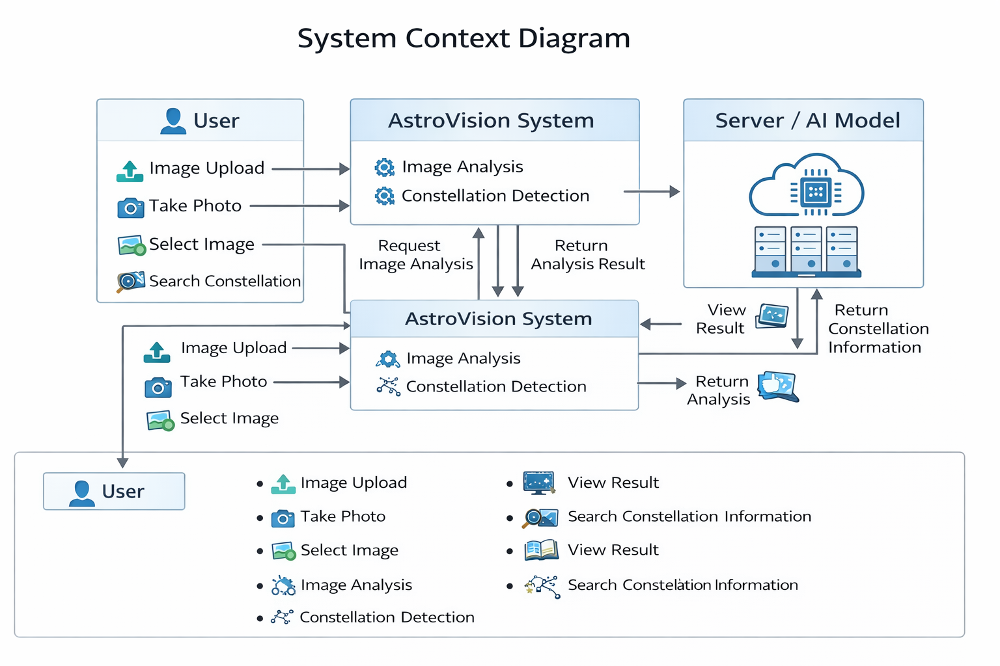

<!-- Heading -->
<h1 align="center">  AstroVision </h1>

<h3 align="center"> 1. Conceptualization </h3>

   

22010910 박성근
 
psg8259@yu.ac.kr

<h2 align="left"> Revision history </h2>

| Revision date | Version # | Description | Author |
| :---: | :---: | :---: | :---: |
| 27/03/2026 | 0.01 | First Documentation | Seonggeun Park |

   
<h2 align="left"> Contents </h2>

1. Business purpose 
___
2. System context diagram
___
3. Use case list 
______
4. Concept of operation 
___
5. Problem statement 
___
6. Glossary 
___
7. References 
___

   
## 1. Bussiness purpose

밤하늘에는 수많은 별과 별자리들이 존재하지만 일반 사람들이 이를 직접 구분하거나 식별하는 것은 쉽지 않다. 실제로 밤하늘을 보면서 어떤 별자리가 있는지 확인하기 위해서는 전문적인 지식이나 별자리 지도와 같은 추가적인 자료가 필요하다.
이러한 문제를 해결하기 위해 본 프로젝트에서는 밤하늘 이미지를 분석하여 별자리를 식별하고 관련 정보를 제공하는 시스템을 개발하고자 한다. 사용자가 밤하늘 사진을 업로드하면 시스템이 이미지 속 별의 패턴을 분석하여 해당 별자리를 인식하고, 그 별자리에 대한 기본적인 설명과 정보를 제공하도록 설계한다. 이를 통해 사용자는 복잡한 천문학 지식 없이도 간단한 사진 촬영만으로 별자리를 확인할 수 있게 된다.
또한 이 시스템은 별자리 학습이나 천문학에 대한 관심을 높이는 교육적인 도구로 활용될 수 있다. 별자리의 이름, 특징, 간단한 설명 등을 제공함으로써 사용자가 밤하늘을 보다 쉽게 이해할 수 있도록 돕는 것을 목표로 한다.
주요 대상 사용자는 천문학에 관심이 있는 일반 사용자와 별자리에 대해 배우고자 하는 학생들이다.

   

## 2. System context diagram

 

- Login -- 로그인
- Register -- 회원가입
- Take Photo -- 카메라를 이용한 사진 촬영
- Select Image -- 저장된 이미지 선택
- Image Upload -- 하늘 사진 업로드
- Image Analysis -- 업로드된 이미지의 별 패턴 분석
- Constellation Detection -- 별자리 식별
- View Result -- 분석 결과 확인 
- Search Constellation -- 별자리 검색
- View Constellation Information -- 별자리 정보 조회

   

## 3. Use case list

### 1) Login
| Actor | User |
| :--- | :--- |
| **Description** | 사용자가 로그인을 한다. |

### 2) Register
| Actor | User |
| :--- | :--- |
| **Description** | 사용자가 회원가입을 한다. |

### 3) Take photo
| Actor | User |
| :--- | :--- |
| **Description** | 사용자가 카메라를 이용하여 밤하늘 사진을 직접 촬영한다. |

### 4) Select image
| Actor | User |
| :--- | :--- |
| **Description** | 사용자가 기기에 저장된 밤하늘 이미지를 선택한다. |

### 5) Image upload
| Actor | User |
| :--- | :--- |
| **Description** | 촬영하거나 선택한 밤하늘 이미지를 시스템에 업로드한다. |

### 6) Image analysis
| Actor | System |
| :--- | :--- |
| **Description** | 시스템이 업로드된 이미지 속 별의 패턴과 밝기를 분석한다. |

### 7) Constellation detection
| Actor | System |
| :--- | :--- |
| **Description** | 분석된 패턴을 바탕으로 이미지 속 별자리를 식별한다. |

### 8) View result
| Actor | User |
| :--- | :--- |
| **Description** | 사용자가 사진 위에 식별된 별자리 선과 이름이 표시된 결과를 확인한다. |

### 9) View constellation information
| Actor | User |
| :--- | :--- |
| **Description** | 식별된 별자리의 유래, 특징, 관측 정보 등 상세 내용을 조회한다. |

### 10) Search constellation
| Actor | User |
| :--- | :--- |
| **Description** | 사용자가 특정 별자리를 이름으로 검색한다. |

### 11) Logout
| Actor | User |
| :--- | :--- |
| **Description** | 사용자가 자신의 계정에서 로그아웃한다. |

   

## 4. Concept of operation

### 1) Login
| 항목 | 내용 |
| :--- | :--- |
| **Purpose** | 앱을 사용하기 위해 등록된 사용자인지 확인 |
| **Approach** | 사용자가 앱 실행 후 로그인 시, ID와 PW를 입력하여 로그인을 요청하면 서버에서 회원 정보를 조회 후 성공/실패 여부를 확인한다. |
| **Dynamics** | 앱 실행 시 로그인이 필요한 경우 |
| **Goals** | 로그인 기능을 구현한다. |

### 2) Register
| 항목 | 내용 |
| :--- | :--- |
| **Purpose** | 앱을 사용하기 위해 사용자 등록 |
| **Approach** | 사용자에게 필요한 정보들을 입력받고 중복되는 ID가 없는지 확인 후 서버에 저장한다. |
| **Dynamics** | 서비스를 이용하기 위해 회원가입을 하는 경우 |
| **Goals** | 회원가입 기능을 구현한다. |

### 3) Take photo
| 항목 | 내용 |
| :--- | :--- |
| **Purpose** | 실시간 촬영을 통한 밤하늘 이미지 확보 |
| **Approach** | 기기의 카메라 기능을 호출하여 사용자가 현재 보고 있는 밤하늘을 촬영하고 데이터를 생성한다. |
| **Dynamics** | 사용자가 현장에서 즉석으로 별자리를 식별하고자 할 때 |
| **Goals** | 카메라 인터페이스 연동 및 사진 촬영 기능을 구현한다. |

### 4) Select image
| 항목 | 내용 |
| :--- | :--- |
| **Purpose** | 기기에 저장된 기존 밤하늘 이미지 선택 |
| **Approach** | 사용자의 갤러리 또는 저장 장치에 접근하여 분석하고자 하는 이미지를 선택한다. |
| **Dynamics** | 미리 찍어둔 사진을 업로드하여 분석하고 싶을 때 |
| **Goals** | 로컬 파일 접근 및 이미지 선택 기능을 구현한다. |

### 5) Image analysis & Constellation detection
| 항목 | 내용 |
| :--- | :--- |
| **Purpose** | 이미지 내 별 패턴 분석 및 별자리 식별 |
| **Approach** | 업로드된 이미지에서 별의 좌표와 밝기를 추출하고, 이를 성표(Star Catalog) 데이터와 대조하여 일치하는 별자리를 인식한다. |
| **Dynamics** | 이미지 업로드가 완료된 후 분석 단계가 실행될 때 |
| **Goals** | 딥러닝 및 이미지 처리 알고리즘을 통한 식별 기능을 구현한다. |

### 6) View result
| 항목 | 내용 |
| :--- | :--- |
| **Purpose** | 식별된 별자리 결과 시각화 |
| **Approach** | 사용자가 업로드한 원본 사진 위에 인식된 별자리의 구획 선과 명칭을 겹쳐서(Overlay) 표시한다. |
| **Dynamics** | 이미지 분석이 완료되어 결과를 출력하는 경우 |
| **Goals** | 사용자에게 직관적인 분석 결과를 제공한다. |

### 7) View constellation information
| 항목 | 내용 |
| :--- | :--- |
| **Purpose** | 식별된 별자리에 대한 교육적 정보 제공 |
| **Approach** | 인식된 별자리에 매칭되는 신화, 관측 가능 시간, 구성 성단 등의 정보를 데이터베이스에서 불러와 제공한다. |
| **Dynamics** | 분석 결과 확인 후 상세 정보를 조회하는 경우 |
| **Goals** | 사용자의 천문학적 학습을 돕는 상세 정보 기능을 구현한다. |

### 8) Search constellation
| 항목 | 내용 |
| :--- | :--- |
| **Purpose** | 특정 별자리 정보의 직접 검색 |
| **Approach** | 사용자가 입력한 키워드를 바탕으로 별자리 리스트를 필터링하여 관련 정보를 검색한다. |
| **Dynamics** | 사용자가 특정 별자리에 대해 궁금하여 검색을 수행할 때 |
| **Goals** | 별자리 데이터베이스 검색 기능을 구현한다. |

   

## 5. Problem statement

### Problem #1 – Technical difficulties in using Image Recognition API/Library
이미지 분석 및 별자리 식별을 위한 외부 라이브러리나 API를 사용해본 경험이 부족하다. 정확한 식별을 위해 OpenCV나 TensorFlow 라이브러리를 학습하여 앱에 적용할 것이다.

### Problem #2 – Image Quality and Light Pollution
밤하늘 사진은 빛 공해나 카메라 흔들림에 의해 별의 패턴이 흐릿하게 보일 수 있다. 전처리 알고리즘을 통해 노이즈를 제거하고 별의 밝기를 강조하여 인식률을 높이는 과정을 거칠 것이다.

### Problem #3 – Real-time Location and Orientation Data
별자리는 관측자의 위치와 시간, 보는 방향에 따라 달라진다. 사진 데이터만으로는 정확한 식별에 한계가 있을 수 있으므로, 기기의 GPS 및 나침반 센서 데이터를 연동하여 식별 정확도를 보완할 것이다.

### Problem #4 – Technical difficulties in Web/App Development
웹 기반 시스템 구축을 위한 프레임워크 사용에 익숙하지 않아 기술적인 어려움이 있다. 계획한 사용자 시나리오를 원활하게 구현할 수 있도록 React 또는 Next.js 프레임워크를 집중적으로 공부할 것이다.

---

### NFRs (Non Functional Requirements)
**성능**: 사용자가 사진을 업로드한 후 별자리 분석 결과가 출력되기까지의 시간은 최대 5초 이내로 한다. 
**가용성**: 별자리 데이터베이스와 정보 조회 서비스는 24시간 언제 어디서든 접근 가능해야 한다. 
**사용성**: 천문학 지식이 없는 일반 사용자와 학생들을 위해 직관적이고 단순한 UI/UX를 제공한다. 
**환경**: 모바일 웹 브라우저(Chrome, Safari 등)에서 최적화된 화면 구성을 지원해야 한다. 
**보안**: 사용자의 위치 정보와 촬영된 사진 데이터는 개인정보 보호 원칙에 따라 안전하게 처리한다.

   

## 6. Glossary

| Term | Description |
| :--- | :--- |
| **별자리 (Constellation)** | 밤하늘의 별들을 연결하여 신화나 동물 등의 모양을 이름 붙인 것 |
| **패턴 분석 (Pattern Analysis)** | 이미지 내 별들의 위치와 밝기 관계를 계산하여 특정 형상을 찾아내는 기술 |
| **성표 (Star Catalog)** | 별들의 위치, 밝기, 고유 번호 등을 기록해 둔 천문 데이터베이스 |
| **이미지 전처리 (Preprocessing)** | 분석 정확도를 높이기 위해 사진의 노이즈를 제거하고 대조를 조절하는 과정 |
| **서버 (Server)** | 회원 정보, 별자리 데이터 및 분석 알고리즘을 저장하고 처리하는 곳 |
| **GPS** | 위도, 경도 값을 통해 사용자의 현재 관측 위치를 파악하는 시스템 |

   

## 7. References

### 1) Yale Bright Star Catalog (천문 데이터베이스)
[http://tdc-www.harvard.edu/catalogs/bsc5.html](http://tdc-www.harvard.edu/catalogs/bsc5.html)

### 2) Google Cloud Vision API (이미지 분석 도구)
[https://cloud.google.com/vision](https://cloud.google.com/vision)

### 3) Kakao Maps API (위치 정보 및 지도 연동)
[https://apis.map.kakao.com/web](https://apis.map.kakao.com/web)

### 4) Stellarium (천문 시뮬레이션 및 검증 참고)
[https://stellarium-web.org](https://stellarium-web.org)